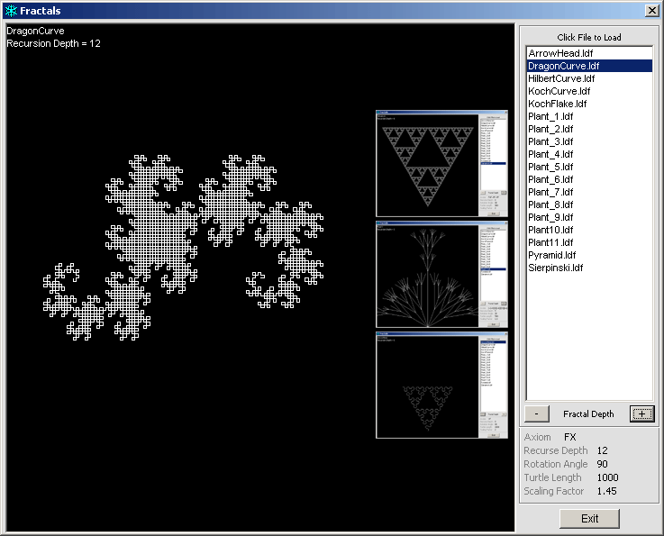



## \[A\+\] \*AWESOME\* VB Fractals \(See Screenshot\)

### Description

The Screenshot says it all, folks! This uses several pre-defined fractal patterns and allows you to increase the depth of the fractal recurssion. Thanks to my friend Johnny Lindenmayer for his help with the designs and concepts. Dont forget to vote. :)
 
### More Info
 

             |
---                |---
**Submitted On**   |2004-01-15 13:29:42
**By**             |[\[\]\)utch\[\]v\[\]aster](https://github.com/Planet-Source-Code/PSCIndex/blob/master/ByAuthor/utch-v-aster.md)
**Level**          |Advanced
**User Rating**    |5.0 (35 globes from 7 users)
**Compatibility**  |VB 3\.0, VB 4\.0 \(16\-bit\), VB 4\.0 \(32\-bit\), VB 5\.0, VB 6\.0
**Category**       |[Graphics](https://github.com/Planet-Source-Code/PSCIndex/blob/master/ByCategory/graphics__1-46.md)
**World**          |[Visual Basic](https://github.com/Planet-Source-Code/PSCIndex/blob/master/ByWorld/visual-basic.md)
**Archive File**   |[\[A\+\]\_\_AWES1694681152004\.zip](https://github.com/Planet-Source-Code/utch-v-aster-a-awesome-vb-fractals-see-screenshot__1-51022/archive/master.zip)

